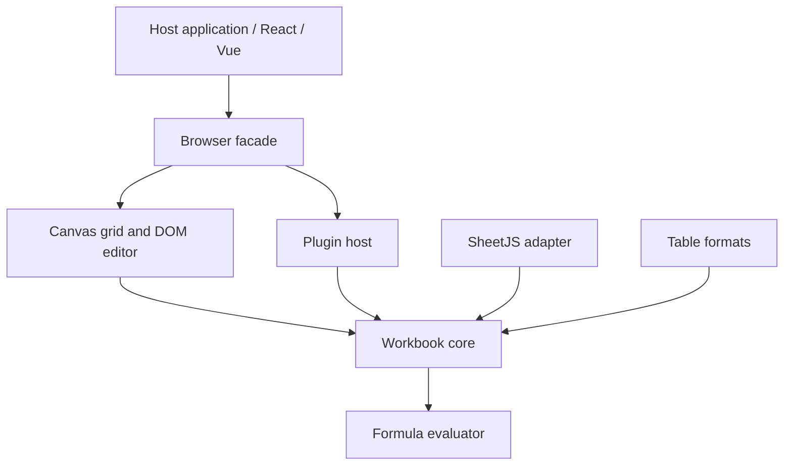

# Architecture

> Design notes, not a claim of implemented functionality. See [implementation status](implementation-status.md) and the [current API](api.md) for supported behavior.

## Purpose

OpenSheet is an embeddable, extensible TypeScript spreadsheet with a reusable headless workbook engine. The browser editor, framework wrappers and host integrations share public contracts. Data processing does not require an account or hosted service.

## Layers and dependency direction

Core owns model validation, commands, transactions and history. Formula owns parsing, calculation and reference transforms. Renderer owns viewport layout, selection and input. The facade combines toolbar, formula bar, sheet tabs and plugins. Adapters and exporters operate on public snapshots. Core must not depend on UI, frameworks, SheetJS runtime, network or billing.

## Current foundation

The workspace includes `opensheet` and `@opensheetjs/core`, `formula`, `renderer`, `plugin-sdk`, `adapter-sheetjs`, `formats`, `react`, `vue` and `testing`. Type declarations and package-consumer checks validate boundaries. The main package exports its stylesheet separately.

The implementation uses stable row/column identities, sparse cells, immutable transactions and synchronous formula calculation. Canvas virtualizes visible cells; a DOM editor handles text entry. The demo imports files in a Worker. Formula calculation itself is not currently isolated in a Worker.

## Internal modules and ownership

Package entry points only expose the public API. Internal modules import definitions directly; cross-package imports use public package names. Pure type relationships use `import type`. `pnpm test:architecture` verifies the source graph, including dynamic imports and re-exports, rejects runtime cycles, and enforces the layer boundaries above. The check runs in `pnpm check`.

| Area | Modules and responsibility | State and resource owner |
| --- | --- | --- |
| Core | Workbook orchestration; Sheet and Range APIs; command schemas and dispatch; cell, axis and sheet mutations; formula calculation; input and display formatting | Workbook owns committed state, drafts, revision, transactions and commit publication. Calculation owns its cache; history owns patch stacks and budget. Workbook invalidates calculation on edits, rollback and undo/redo. Sheet and Range refer back through type-only imports. |
| Formula | AST and errors, address conversion, parser, evaluator, printer, reference transforms | Each evaluation owns its bounded traversal. No workbook or browser dependency. |
| Renderer | Shared layout and hit testing, merged selection, Canvas painting, DOM editor, pointer/keyboard input and clipboard | Grid coordinates the active sheet, layout invalidation and animation scheduling. Selection owns the selection and merge index. Editor owns edit position and IME state. Input owns listeners and pointer drag state. Grid disconnects its observer, subscription and frame on disposal. |
| Browser facade | Workbook and plugin lifecycle; toolbar and overflow menu; formula bar; sheet tabs; status and toast; typed events | Each view owns its DOM listeners. Toolbar owns its observer, global dismiss listeners and frame. Tabs release old button listeners on each render. Plugin toolbar removals release their action listeners. Toast owns its timer. Facade disposes views and the active workbook. |
| Interoperability | SheetJS import/export, cell conversion and compatibility reporting; range preparation, escaping and per-format generators | Conversion uses public snapshots. Export orchestration disposes the temporary headless workbook even if preparation or generation fails. |
| Plugins | Public contracts, dependency ordering, capability context, registry lifecycle | Registry owns installed APIs and cleanup callbacks. Setup failure and dependency rollback release resources in reverse order. |
| Playground | Page mounting, shared application state, routing, insights, code preview, workbench layout, file actions and interactions | Main assembles modules and disposes them on pagehide. File actions own the import Worker, timeout and download URLs; generation and Worker identity reject stale results. Preview owns its debounce timer; workbench owns its observer; feedback owns its notice timer. |

Internal collaborators receive narrow actions and data, rather than the coordinating class or a global service container. Layout offsets are shared by painting, hit testing, navigation and editor positioning. Lightweight framework wrappers and testing helpers remain small lifecycle adapters.

## Longer-term goals

Incremental dependency indexing, isolated calculation, extensible calculation providers, richer plugin interfaces, persistence ports and better viewport indexing require separate design and verification. They must not be described as existing features. Accessibility needs real screen-reader and IME acceptance in addition to synthetic browser tests.

Performance targets must be measured with reproducible fixtures, environment details, repeated runs and percentile results. A single headless benchmark is diagnostic only. Resource limits are protection boundaries, not responsiveness guarantees.

## Integration principles

Use one authoritative workbook model. Persist native JSON for OpenSheet-supported data. Route writes through validated commands, never mutate internal storage. Host networking and storage stay outside the core. Release listeners, Workers, plugin resources and editor instances on disposal. Treat plugins as trusted code until a real isolation boundary exists.
