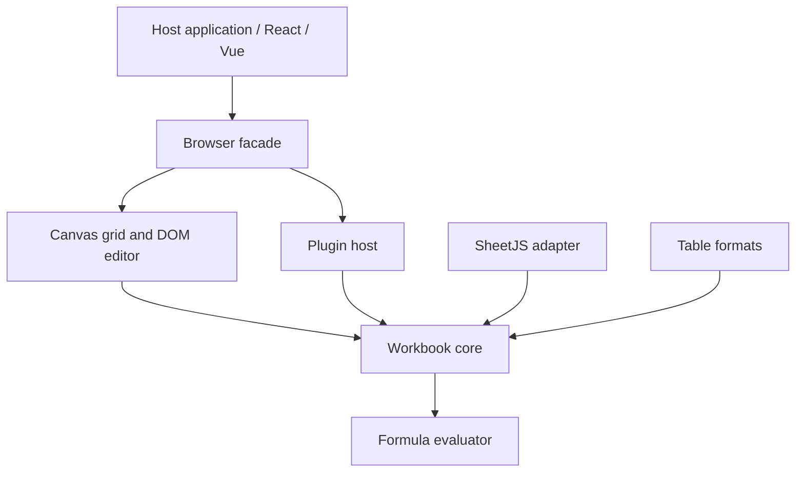

# Architecture

> Design notes, not a claim of implemented functionality. See [implementation status](implementation-status.md) and the [current API](api.md) for supported behavior.

## Purpose

OpenSheet is an embeddable, extensible TypeScript spreadsheet with a reusable headless workbook engine. The browser editor, framework wrappers and host integrations share public contracts. Data processing does not require an account or hosted service.

## Layers and dependency direction

Core owns model validation, commands, transactions and history. Formula owns parsing, calculation and reference transforms. Renderer owns viewport layout, selection and input. The facade combines toolbar, formula bar, sheet tabs and plugins. Adapters and exporters operate on public snapshots. Core must not depend on UI, frameworks, SheetJS runtime, network or billing.

## Current foundation

The workspace includes `opensheet` and `@opensheetjs/core`, `formula`, `renderer`, `plugin-sdk`, `adapter-sheetjs`, `formats`, `react`, `vue` and `testing`. Type declarations and package-consumer checks validate boundaries. The main package exports its stylesheet separately.

The implementation uses stable row/column identities, sparse cells, immutable transactions and synchronous formula calculation. Canvas virtualizes visible cells; a DOM editor handles text entry. The demo imports files in a Worker. Formula calculation itself is not currently isolated in a Worker.

## Longer-term goals

Incremental dependency indexing, isolated calculation, extensible calculation providers, richer plugin interfaces, persistence ports and better viewport indexing require separate design and verification. They must not be described as existing features. Accessibility needs real screen-reader and IME acceptance in addition to synthetic browser tests.

Performance targets must be measured with reproducible fixtures, environment details, repeated runs and percentile results. A single headless benchmark is diagnostic only. Resource limits are protection boundaries, not responsiveness guarantees.

## Integration principles

Use one authoritative workbook model. Persist native JSON for OpenSheet-supported data. Route writes through validated commands, never mutate internal storage. Host networking and storage stay outside the core. Release listeners, Workers, plugin resources and editor instances on disposal. Treat plugins as trusted code until a real isolation boundary exists.
